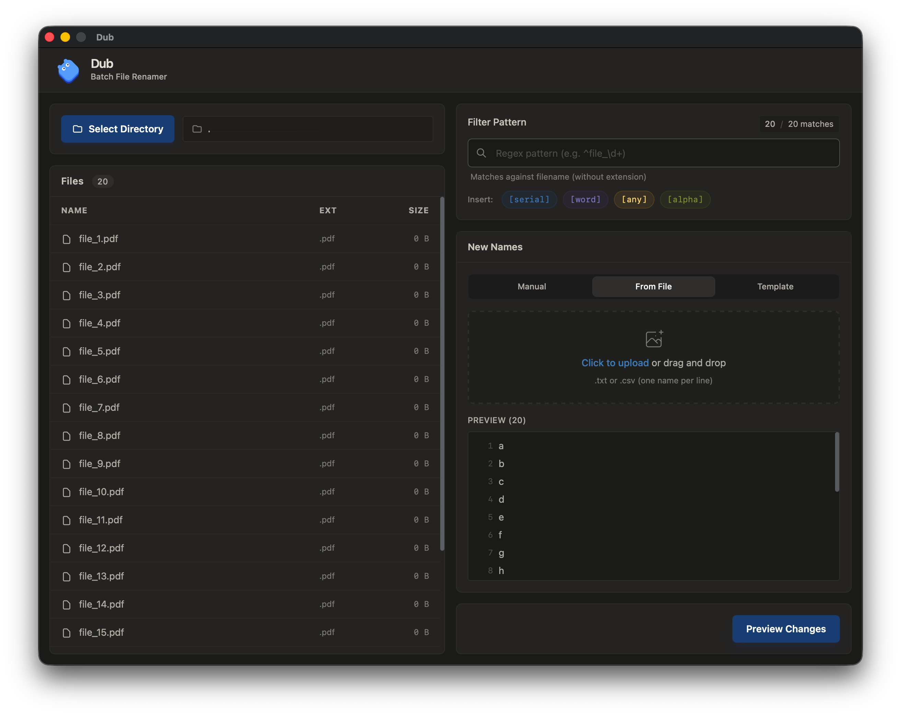

<p align="center">
  
</p>

# Dub

A desktop batch file renamer built with Go, designed for fast and intuitive bulk renaming workflows.

 

## Features

- **Native directory picker** — uses OS-native dialog via Wails runtime
- **Pattern filtering** — regex-based file filtering with shortcuts (`[serial]`, `[word]`, `[alpha]`, `[any]`) matched against filename stems (without extension)
- **Natural sort** — files are sorted naturally (`file_2` before `file_10`)
- **Three naming modes**
  - **Manual** — per-file input fields with auto-save
  - **From File** — upload a `.txt` or `.csv` with one name per line
  - **Template** — generate names using `{index}` and `{original}` placeholders
- **Preview before commit** — see `original → new` mapping with conflict detection before any files are touched
- **Conflict safety** — all duplicate target names are flagged; conflicting files are never renamed
- **CJK input support** — IME-aware debouncing prevents composition interruption for Chinese, Japanese, and Korean input

## Tech Stack

| Layer | Technology |
|-------|-----------|
| Runtime | [Wails v2](https://wails.io/) — Go + native WebView |
| Templates | [Templ](https://templ.guide/) — type-safe Go HTML templates |
| Frontend | [HTMX](https://htmx.org/) + [Tailwind CSS](https://tailwindcss.com/) (CDN) |

## Architecture

Dub follows a hexagonal (clean) architecture with dependency injection:

```
Domain (entities, sort) ← Ports (interfaces) ← Services (use cases) → Adapters (OS fs, regex)
                                                       ↑
                                                  App (handlers, state, DI wiring)
```

All state is server-side. The frontend is pure HTML rendered by Templ, with HTMX handling partial page updates. No client-side JavaScript framework is used — only a small `bridge.js` for IME handling and Wails runtime integration.

## Getting Started

### Prerequisites

- [Go](https://go.dev/) 1.26+
- [Task](https://taskfile.dev/) (Task runner)
- [Wails CLI](https://wails.io/docs/gettingstarted/installation) v2
- [Templ](https://templ.guide/quick-start/installation) CLI

```bash
go install github.com/go-task/task/v3/cmd/task@latest
go install github.com/a-h/templ/cmd/templ@latest
go install github.com/wailsapp/wails/v2/cmd/wails@latest
```

### Development

```bash
# Generate templ files and start dev server with hot reload
task dev
```

This runs `templ generate -watch` and `wails dev` concurrently.

### Build

```bash
# Production build
task build
```

Outputs a standalone binary in `build/bin/`.

## Testing

```bash
# Run all tests
task test
```

## How It Works

1. **Select Directory** — opens a native OS dialog, scans files with natural sort
2. **Filter** (optional) — type a regex or use shortcuts to narrow down files
3. **Name** — enter new names manually, upload from file, or generate from template
4. **Preview** — review the `original → new name` mapping; conflicts are highlighted in red
5. **Execute** — rename files on disk; conflicting entries are safely skipped

## Installation

Download the latest release from the [Releases](../../releases) page.

#### macOS Installation Notes

After downloading and installing the DMG, you may encounter a security warning. This is normal for unsigned applications. To resolve:

**Option 1: Command Line (Recommended)**
```bash
# Remove quarantine attribute
xattr -rd com.apple.quarantine /Applications/Dub.app
# Then open the app normally
open /Applications/Dub.app
```

**Option 2: System Preferences**
1. Click "Cancel" when you see the warning
2. Go to System Preferences → Privacy & Security
3. Look for "Dub.app was blocked" notification
4. Click "Open Anyway"

**Option 3: Right-click Method**
1. Right-click on Dub.app in Applications
2. Select "Open" from the context menu
3. Click "Open" in the security dialog

## License

[MIT](LICENSE)
